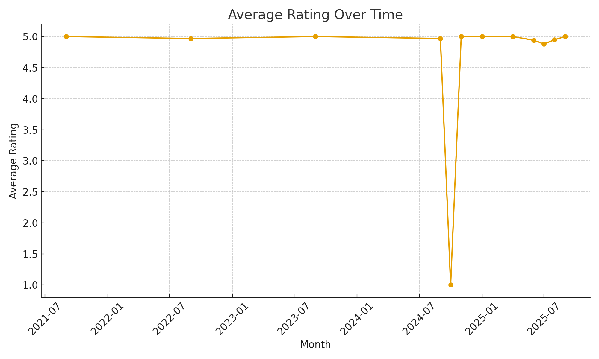
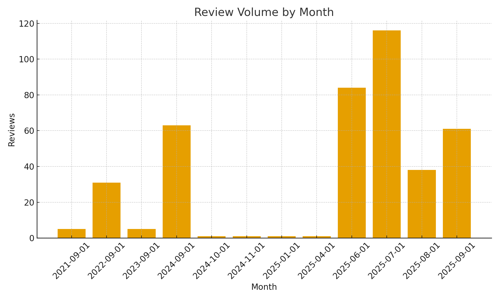
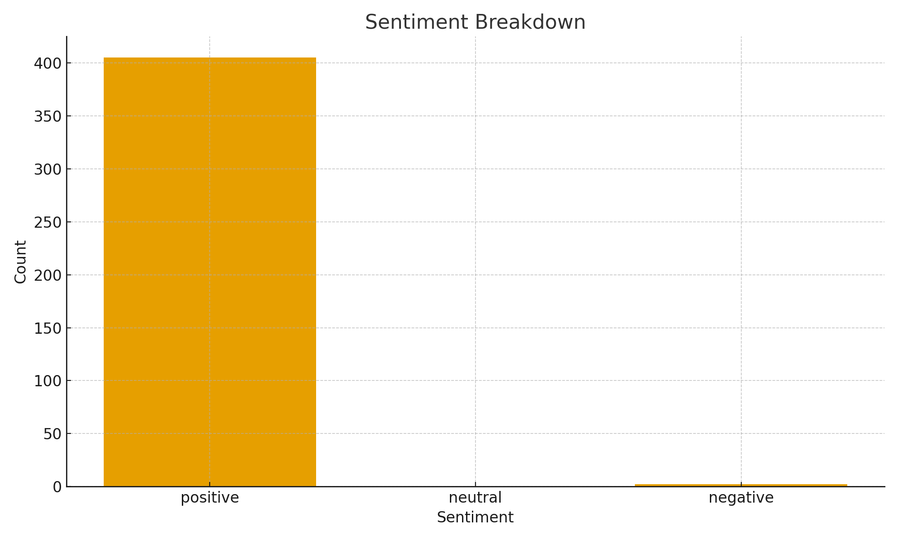
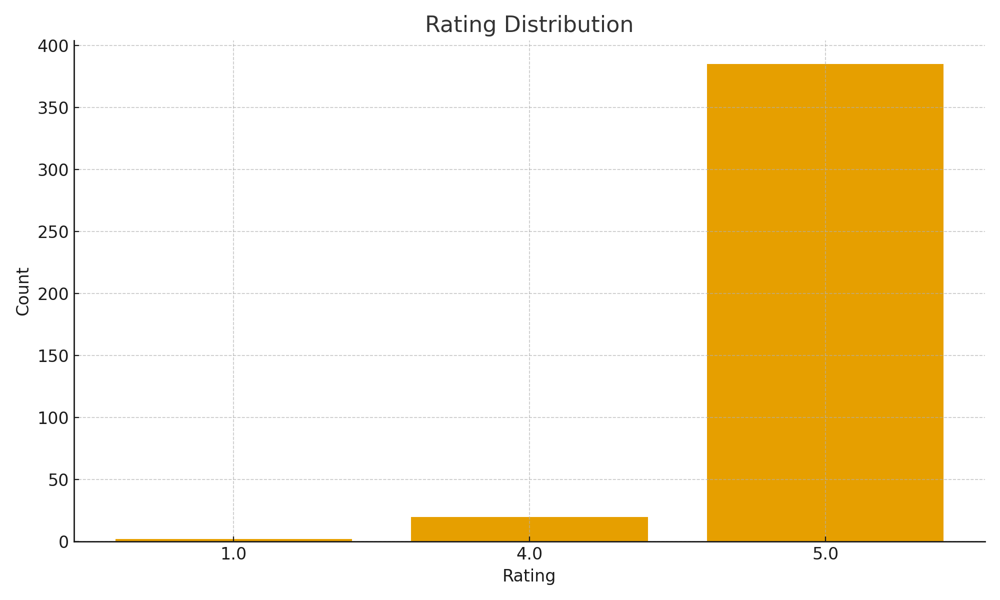
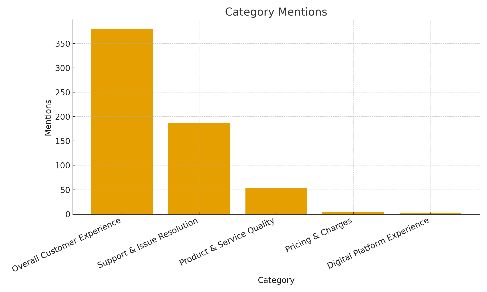

# Motilal Oswal - Google Customer Reviews Analysis 

## Customer Experience

* Reflects overall feelings across touchpoints: staff, RMs, branches.
* Positive signals: friendly, helpful, professional, seamless, trustworthy.
* Negative signals: delays, rude behavior, poor communication.
* Improvements:

  * Standardize greetings and follow-up scripts.
  * Proactive communication on pending actions.
  * Map customer journey to identify friction points.
  * Track NPS and CES regularly.

---

## Product & Service Quality

* Covers research, advisory, portfolio guidance, trading execution.
* Positive signals: high-quality advice, useful research, smooth execution.
* Negative signals: poor recommendations, missed opportunities.
* Improvements:

  * Standardize advisory frameworks.
  * Share outcome-based case studies.
  * Personalize recommendations using profiles/AI.
  * Train staff continuously on markets and compliance.

---

## Pricing & Charges

* Includes brokerage, commissions, AMCs, hidden costs.
* Positive signals: fair pricing, value for money.
* Negative signals: hidden charges, unexpected deductions.
* Improvements:

  * Transparent fee pages with examples.
  * Interactive brokerage calculators.
  * RM scripts to explain pricing in simple terms.
  * Alerts before and after charges are applied.

---

## Digital Platform Experience

* Encompasses app, website, trading portals.
* Positive signals: easy to use, smooth login, modern interface.
* Negative signals: login/OTP issues, app crashes, slow performance.
* Improvements:

  * Track metrics: crash-free sessions, login success, latency.
  * Conduct quarterly UX testing.
  * Add self-help modules for login/OTP issues.
  * Prioritize stability fixes before adding new features.
  * Balance security with simplicity in KYC and payments.

---

## Support & Issue Resolution

* Concerns responsiveness and empathy in resolving problems.
* Positive signals: quick resolutions, supportive staff, good response times.
* Negative signals: delays, unresolved issues, lack of follow-up.
* Improvements:

  * Define SLAs (urgent vs normal cases).
  * Ensure consistent omni-channel support.
  * Collect CSAT/NPS after resolution.
  * Clear escalation protocols communicated to customers.
  * Maintain a knowledge base to reduce repetitive tickets.

---

## Strategic Recommendations

**Quick Wins**

* Publicly respond to all negative reviews with contact and resolution path.
* Publish transparent pricing explainer and calculators.
* Add login/OTP troubleshooting guides in app.
* Feature positive reviews in onboarding and marketing.

**Long-Term**

* Establish Voice of Customer program with monthly reviews and branch scorecards.
* Showcase advisory quality through recurring highlights and case studies.
* Set digital performance OKRs (login success, crash-free sessions).
* Implement support SLAs and measure first-contact resolution.
* Use AI to personalize product nudges, pricing calculators, and support FAQs.

---

## 1. Average Rating Over Time

* Shows how the average review rating has evolved month by month.
* Helps identify whether customer satisfaction is **improving, declining, or stable** over time.
* Useful for spotting dips that may correlate with operational or digital issues.

---

## 2. Review Volume by Month

* Displays the **number of reviews received per month**.
* Indicates the level of customer engagement and feedback activity.
* Spikes can suggest events (e.g., new product launch, campaign) while dips may indicate reduced customer outreach.

---

## 3. Sentiment Breakdown

* Shows distribution of **positive, neutral, and negative sentiment** (rating-based).
* Highlights overall tone of customer perception.
* A strong positive skew indicates satisfaction; even small negative bars highlight areas needing attention.

---

## 4. Rating Distribution

* Illustrates how reviews are spread across 1–5 star ratings.
* Quickly shows whether ratings cluster at the top or are spread across.
* Helps validate the reliability of the high average rating (not skewed by few outliers).

---

## 5. Category Mentions

* Keyword-based mapping of reviews into **focus categories**:

  * Customer Experience
  * Product & Service Quality
  * Pricing & Charges
  * Digital Platform Experience
  * Support & Issue Resolution
* The taller the bar, the more frequently customers talk about that category.
* Helps prioritize focus areas based on customer voice.
